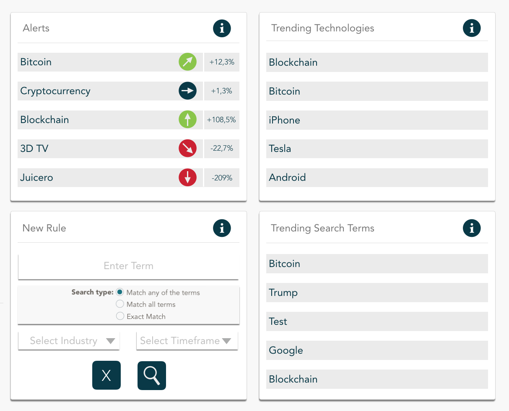

# Alert Mockup

Trend Detection - users want to get informed about trends - not only by searching for one trend occasionally, but once set an "Alert" for one trend and get informed about this trend on a regular basis.
An Alert is a search over a set time frame. An Alert is set by the user on the alert page. Therefore the user sets a rule, which consists of a search term, the search type, an optional industry and  a time frame.

## Mockup

The Mockup consists of an "Alerts"-section, a "New Rule"-section, a "Trending Technologies"-section and a "Trending Search Term"-section. 
Those terms will be explained and in the work breakdown the tasks how to achieve those solutions are explained.

### Alerts

You can search for one or more search terms in the dashboard, but if you want to check regularly on one search term this is not the easiest solution. Therefore you can create a rule. A rule saves the seearch term with additional information like the search type, the industry and the time frame.
Those previously given rules are evaluated in the "Alerts"-section. The search term is analyzed over the given time frame or a default time frame in the backend. If a user enters the Alerts page, those results are displayed. There is a trend indication given visually and in percentage. The percentage shows how often the term was mentioned in the second half of the time frame compared to the first half of the time frame. The visual indication shows if the trend is rising, falling or stagnating.

### New Rule

If you want to check on a search term on a regular basis, you can enter it as a rule. Therefore the search term and type are added as well as optionally the industry and timeframe. The industry is used to compare the search term to trends from the selected industry or to find correlations. The time frame is used to calculate the trend indication. It is used to indicate a short or long time analysis.

### Trending Technologies

The trending technologies should be trends self detected by the system. Trends are defined here as words with increasing mentions in a specific industry. Industries would be defined manually or extracted from data and terms increasingly coming up with those industries would be counted as trends. Although stop words would need to be erased.

### Trending Search Terms

The trending search terms section is giving a list of search terms used by all users. Ranked either after serch count, or increased search count compared to last month/last year/last week.

## Work Break Down
Tasks divided by Topics with an effort estimation based on the established story points during the project phase. Starting with 1 - minimal effort. Up to 13 - too big effort. It could be something like 1 - less than a hour, 5 - one day, 8 - one week, and 13 - not feasible - at least not in one sprint.

- Alerts
    - Run flow engine (Check updates on rules)
    - Regularly look for search terms (8)
    - Calculate indication (regularly) (5)
    - Display results (5)
- Rules
    - Rule Engine 
    - Save searches (8)
    - create new searches - saved as rules (5)
- Trending Search terms
    - Database - store all search requests (and normalize them - xy was most often searched, but relevant are things that are more searched than last month/year)
    - Store all searches (8)
    - Normalize Results (8)
- Trending Technologies
    - Reguarly import data (cronjob) (13)
    - Count all used words (13)
    - Define industries - automotive, consumer, software, IT, cryptography… (13)
    - Look for new terms with industries as "buzzword" (13)
