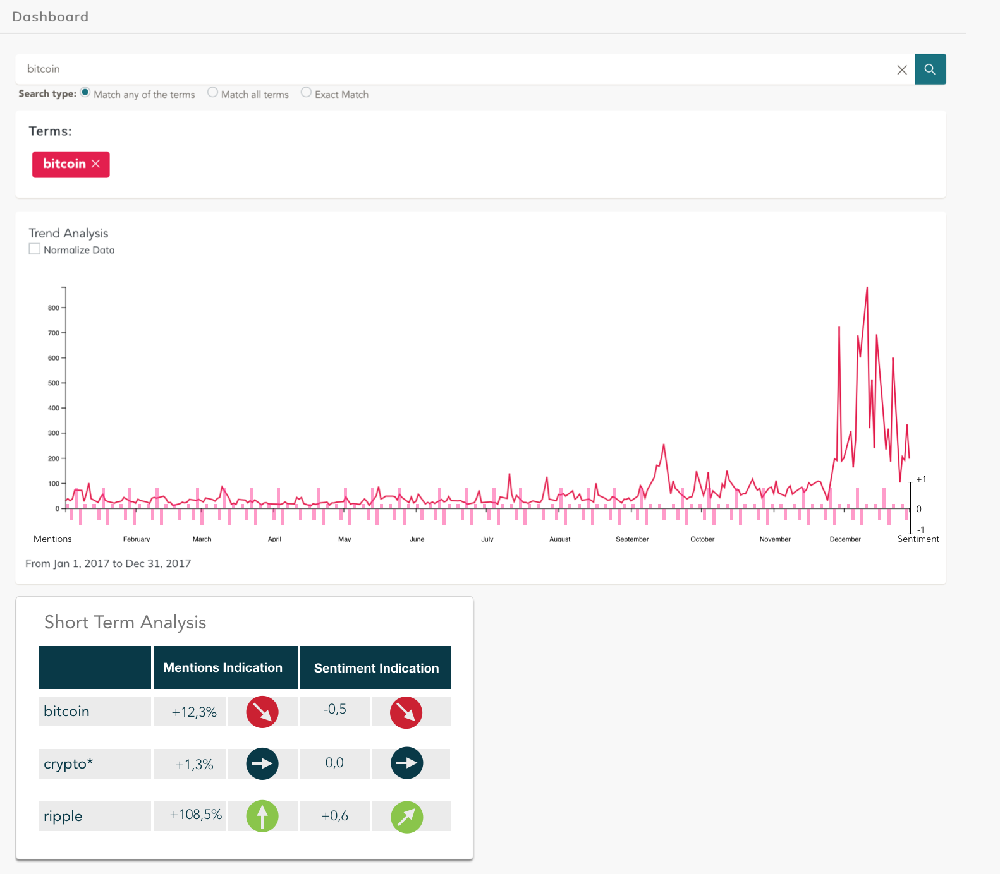

# Sentiment Mockup

In addition to the word count metric, a sentiment could be added to detect trends. This could mean to have a short term analysis and look at the change in twitter sentiment over the last week or taking the average tone given by the GDELT data source.

## Mockup

The Mockup includes a sentiment as time series analysis and a short term twitter analysis.

## Time Series

Displayed within the mentions graph the average tone over this time is displayed. The tone is calculated by the GDELT data source and provided within the data. It gives an idea if the mentions at a point of time are positiv, negativ or neutral.

## Short Term Analysis

To get an idea of the latest evolution of the trend the twitter sentiment from the last 7 days is analyzed. Then the sentiment of the last week is given as well as if it was rising, falling or stagnating over the week.

## Work Breakdown

Tasks divided by Topics with an effort estimation based on the established story points during the project phase. Starting with 1 - minimal effort. Up to 13 - too big effort. It could be something like 1 - less than a hour, 5 - one day, 8 - one week, and 13 - not feasible - at least not in one sprint.

sentiment analysis based on group of tweets 
- The sentiment analysis mines the tweets for trigger words that indicate general positive and negative sentiment
- Here are distributions of the scores for each cryptocurrency: Here are the overall averages for each digital asset: We can also learn about the extreme sentiment values to see who has the  *most positive and negative mentions*

**Short Term Sentiment via Twitter**
- collect and aggregate tweets for each desired trend term (5)
- run sentiment analysis on groups of tweets (probably: most recent 500 tweets) (8)

**GDELT Tone**
- Get GDELT tone (8) (if data needs to be newly integrated)
- Calculate average GDELT tone (e.g. 1 week/month time frame) (5)
- Add sentiment axis to the right of chart (5)
- Add bars for weekly/monthly sentiment (8)

optional: - change mentions axis -> yearly average = 0, mentions = mention - avg (8)
