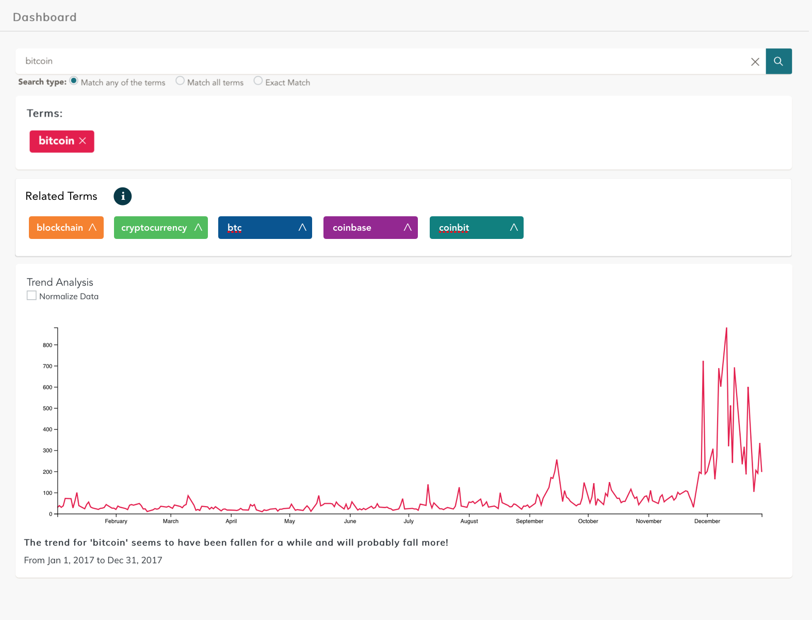

# Related Terms / Topic Clustering

In addition to the word count metrics it could be interesting to look at similar topics or the same industry. This could help to understand if a technology is rising in its field or a whole industry is coming up. For example if a specific craft beer is trending or all craft beers.

When entering a search term it should be easy to search for similar terms. Those could be terms from the same industry or topic or often coming up with the term itself. This can be achieved on different ways. We want to display our topic clusters idea here.

## Mockup

In addition to the search term a new section comes up with the title related terms. In this section similar terms are presented and can be added to the search terms by the user.

### Related Terms

The idea is coming from googles suggestions and google correlate. Google is suggesting similar search terms at their search. Google correlate (https://www.google.com/trends/correlate) "Google Correlate finds search patterns which correspond with real-world trends." Where similar trends are searched with a nearest neighbor method.

How related search terms are defined at google trends:

> **Top searches** are terms that are most frequently searched with the term you entered in the same search session, within the chosen category, country, or region. If you didn't enter a search term, top searches overall are shown.

> **Rising searches** are terms that were searched for with the term you entered (or overall, if no keyword was entered), which had the most significant growth in volume in the requested time period. For each rising search term, you’ll see a percentage of the term’s growth compared to the previous time period. If you see “Breakout” instead of a percentage, it means that the search term grew by more than 5000%.

Since our data is structured differently than search terms, we came up with another solution. We always get one headline which definitely includes the search term. Quite often other correlating words are represented. Those terms can work to find the industry or major theme. After finding a major theme, other terms mentioned with that theme are searched. Those terms are listed after mentions.

## Work Break Down
Tasks are presented with an effort estimation based on the established story points during the project phase. Starting with 1 - minimal effort. Up to 13 - too big effort. It could be something like 1 - less than a hour, 5 - one day, 8 - one week, and 13 - not feasible - at least not in one sprint.

- get BigARTM into pipeline (13)
- use topic clustering on query results (13)
- summarize top five/ten topics (8)
- display topics in topic cluster frontend element (8)
- possibility to add clustered topics to graph (8)
